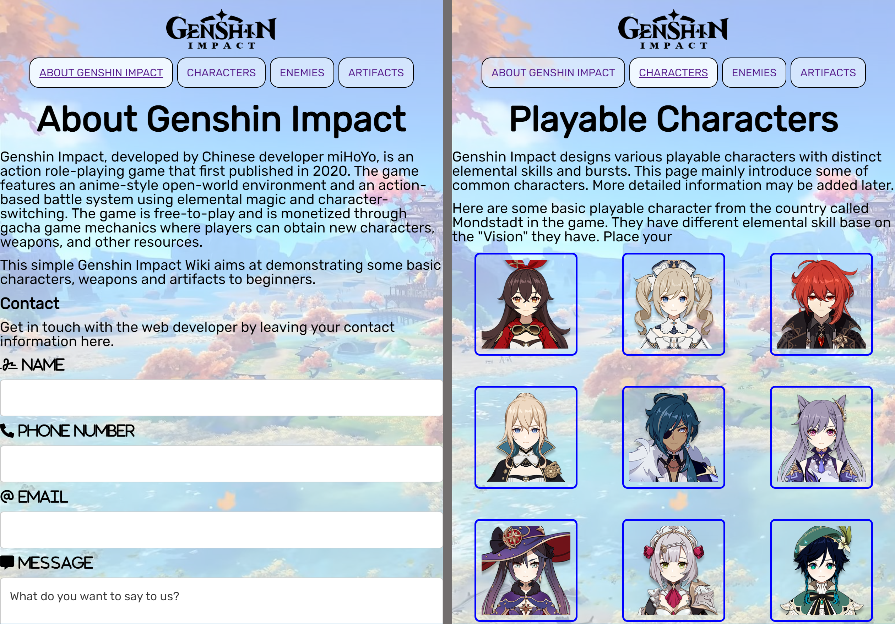

# My Portfolio

## VE441 - App Development for Entrepreneurs

2022.05 - 2022.08

I implemented a simple Chatter app with Kotlin on Android platform.

## EECS494 - Computer Game Design and Development

2022.02 - 2022.04

<iframe width="560" height="315" src="https://www.youtube.com/embed/BWS21aGWRQA" title="YouTube video player" frameborder="0" allow="accelerometer; autoplay; clipboard-write; encrypted-media; gyroscope; picture-in-picture" allowfullscreen></iframe>

In this course, we learned the basic game developing techniques with Unity and designed our own independent game (the following is the demo video). Please refer to my [EECS494 Course Portfolio](http://www-personal.umich.edu/~junqich/Portfolio/) page for game download and more information.

## SI539 Web Design

2021.09 - 2022.01

In this course, I implemented a [Simple Genshin Impact Wiki](https://cjqcjqhhh.github.io/si539-portfolio/index.html) as my final project.

